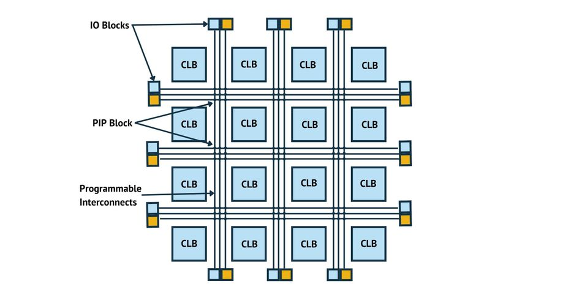
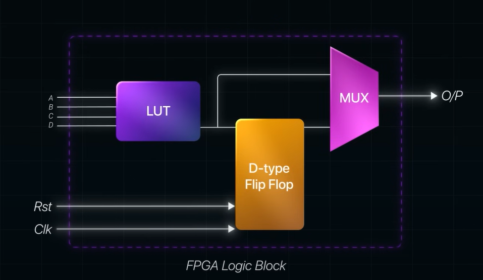
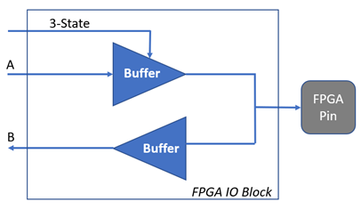
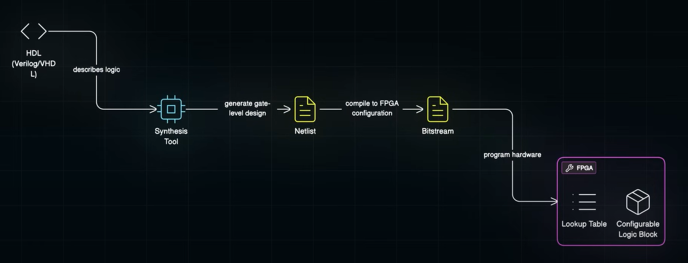

# FPGA

This repo contains the understanding of FPGA's, eFPGA's and other such related concepts

## FPGA'S
Field Programmable Gate Arrays (FPGA) is a special type of integrated circuits (IC) which means a chip which contains many tiny electronic components such as **logic gates**, **memory** and **connectors**

FPGA is different from traditional chips like CPUs or GPUs as it is not locked to a single function. It can be reprogrammed even after its build allowing it to be customised according to our needs

 

### CLB (Configurable Logic Blocks)
They are reusable units inside FPGA's which performs simple logical tasks like **AND**, **OR** or **Addition**. They can be combined in different ways to build complex hardware units
 
 

#### LUT (Look Up Tables)
Look up tables can be understood as a small hard coded if-else table that maps to outputs

Inside of hardwiring logic gates, FPGA's use LUT to simulate behaviour of a truth table. This means that a sinlge LUT can be reprogrammed to act like small logic function

## Programmable Interconnects
- These are the wires that carry signals to different parts of the chips. 
- They aren't fixed and we can decide which blocks they can connect.
- They allow us to control how data flow through the FPGA

## I/O Blocks
They connect the FPGA to the outer world. They lies beside the input and output pins and can be set up to:
- Receive data
- send data
- stay idle

## Synthesis Process

1. An **HDL (Hardware Description Language)** is used to describe what the hardware should be
2. Then there is a synthesis tool which configures LUT, flip-flops and routing inside FPGA to match the design and generates a netlist
3. **Netlist** is a low-level blueprint of how logic gates and connections should be laid out in hardware.
4. Bitstream is generated to program the FPGA

# eFPGA ()
- Embedded FPGA's is a programmble FPGA sold as an IP core that can be integrated directly into SoCs, rather than a standalone packaged chips.

- Unlike traditional FPGAs that are standalone chips with their own packaging, I/O pads, power circuits and peripherals, eFPGAs are semiconductor IP blocks (blueprints) that chip designers license and embed into their custom chips

 

**Architecture**  
eFPGAs consist of the same core components as traditional FPGAs - CLBs, LUTs, registers, interconnects, and PIPs.   
But we can customize exactly how many of each resource we need. We can control the aspect ratio, number of I/O ports, embedded memory size, and DSP blocks, allowing precise tradeoffs between power consumption, area, and performance